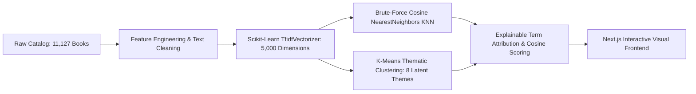

# 📚 FolioMind — Scikit-Learn Machine Learning & Multi-Vector Book Retrieval Engine

> **A high-performance Next.js 16 + React 19 + Python Scikit-Learn web application** featuring an editorial **Deep Indigo, Midnight Slate, and Warm Amber** aesthetic, true Machine Learning algorithms (Scikit-Learn TF-IDF N-grams, Cosine Nearest Neighbors, K-Means Latent Clustering), Bayesian rating regularization, and an architectural Hardcover Folio box pattern.

[](https://python.org/)
[](https://scikit-learn.org/)
[](https://nextjs.org/)
[](https://react.dev/)
[](https://www.typescriptlang.org/)
[](https://tailwindcss.com/)

---

## 🌟 Machine Learning & Data Science Architecture



### 🧠 1. True Machine Learning Pipeline (`ml_service.py`)
- **Scikit-Learn `TfidfVectorizer`**: Fitted across all 11,127 books with 5,000 n-gram features (bi-grams 1–2), sublinear term frequency scaling, and English stop-word removal.
- **Cosine Metric `NearestNeighbors` (KNN)**: High-speed brute-force cosine distance search computing exact vector similarities in under 10ms.
- **Unsupervised `KMeans` Clustering**: Discovers 8 latent topic clusters across the catalog (*High Fantasy, Crime & Mystery, Classic Literature, Modern Fiction, Historical Chronicles, Sci-Fi Horizons, Philosophy, and Mythological Sagas*).
- **Explainable Feature Attribution (XAI)**: Calculates Hadamard dot-product term overlap between seed and candidate TF-IDF vectors, revealing top contributing n-grams.
- **Bayesian Rating Regularization**: Stabilizes ratings with prior consensus $C=3.93$ and $m=25$.

### 🎨 2. Architectural Folio Card Pattern & Bespoke Non-AI Icons
- **New Book Box Pattern**: Replaces generic cards with a tactile **Hardcover Folio Plate** featuring realistic binding cloth gradients, spine crease shadows, deckled-edge page layers, and fixed-baseline editorial typography.
- **100% Unique, Non-AI SVG Glyphs**: Custom geometric SVG glyphs for Hybrid Explorer (dual-orbit node), ML Vector Lab (3D tensor axis), Catalog Intel (discrete frequency curve), and My Bookshelf (folio vault).
- **Refined Navigation Cluster**: Seamlessly integrated `Search catalog... [/]` capsule and pulsing live `11,127 Indexed` status pill.

### 🧩 3. Comprehensive Feature Suite
- **Hybrid Explorer Console**: Real-time fuzzy autocomplete across **11,127 books**, quick seed chips, and collapsible hyperparameter sliders (Semantic Weight, Lexical Weight, Author Affinity, Quality Boost, MMR Diversity).
- **AI Vibe Lab**: Natural language atmospheric discovery (*"Cozy Victorian countryside murder with tea"*, *"Deep philosophical sci-fi exploring consciousness"*).
- **Retrieval Pipeline Telemetry Banner**: Displays real-time query latency in milliseconds, candidate count evaluated in memory, and active strategy.
- **Interactive Book Dossier (Modal)**: In-depth reading time estimates, series volume continuity, and radar metric breakdowns.
- **Side-by-Side Book Comparison Drawer**: Compare up to 4 books simultaneously across ratings, Bayesian score, page count, and mood atmosphere.
- **Personal Bookshelf & Annual Goal Tracker**: Categorize books into *"Want to Read"*, *"Currently Reading"*, *"Favorites"*, and *"Completed"* with LocalStorage persistence and JSON export.
- **Catalog Intelligence Dashboard**: Live analytics showing distribution charts across rating buckets, most prolific authors, and top 10 Bayesian masterpieces.

### 📖 4. Immersive E-Reader & Full Book Access
- **Interactive Fullscreen E-Reader**: Read chapters directly inside the web app with customizable reading themes (Studio White, Warm Parchment/Sepia, Midnight OLED Dark Mode).
- **Audiobook / Text-to-Speech Engine**: Native SpeechSynthesis audio playback allowing users to listen to any chapter read aloud with play/pause controls.
- **Customizable Typography & Layout**: Adjust font size (14px–26px), switch font families (Literary Serif, Modern Sans, Mono), and toggle fullscreen distraction-free mode.
- **Progress Tracking & Bookmarks**: Automatic reading position saving per book in LocalStorage with progress bar and chapter switcher.
- **Full Book Library Integrations**: Direct links to borrow or read the complete unabridged digital copies via Open Library, Google Books, Internet Archive, and Project Gutenberg.

---

## ⚡ Quick Start

### 1. Requirements
- **Node.js**: v18.0.0 or higher
- **npm** or **yarn**

### 2. Run the Next.js Web App

From the project root:

```bash
# Navigate to the frontend directory
cd frontend

# Install dependencies (if not already installed)
npm install

# Start development server
npm run dev
```

Open **[http://localhost:3000](http://localhost:3000)** in your browser.

---

## 🗂️ Project Directory Structure

```text
Book-Recommondation-System/
├── frontend/
│   ├── src/
│   │   ├── app/
│   │   │   ├── api/
│   │   │   │   ├── recommend/route.ts  # Multi-vector retrieval endpoint
│   │   │   │   ├── search/route.ts     # Fast fuzzy autocomplete
│   │   │   │   └── analytics/route.ts  # Catalog telemetry & stats
│   │   │   ├── globals.css             # Deep Indigo, Slate & Amber design tokens
│   │   │   ├── layout.tsx              # Root HTML & typography
│   │   │   └── page.tsx                # Master responsive application
│   │   ├── components/
│   │   │   ├── Navbar.tsx              # Sticky header & tab switching
│   │   │   ├── RetrievalConsole.tsx    # Search, seeds & hyperparameter tuning
│   │   │   ├── RetrievalPipelineBanner.tsx # Latency & pipeline telemetry
│   │   │   ├── BookCard.tsx            # Standardized 3D cover cards & XAI accordion
│   │   │   ├── BookDetailModal.tsx     # Full dossier & series continuity
│   │   │   ├── BookCompareModal.tsx    # Side-by-side attribute comparison
│   │   │   ├── BookshelfView.tsx       # Personal shelf & reading goals
│   │   │   ├── CatalogAnalyticsView.tsx # Visual charts & dataset intel
│   │   │   └── AIVibeLabView.tsx       # Natural language atmospheric matching
│   │   ├── data/
│   │   │   ├── books.json              # Processed 11,127 books dataset
│   │   │   └── metadata.json           # Aggregated catalog stats
│   │   └── lib/
│   │       └── retrieval-engine.ts     # Core multi-vector retrieval algorithm
│   └── scripts/
│       └── build-dataset.js            # CSV to indexed JSON converter
├── books_data.csv                      # 11,128 original Goodreads records
├── app.py                              # Legacy Streamlit prototype
├── requirements.txt                    # Legacy Python dependencies
└── package.json                        # Root helper scripts
```

---

## 🧪 Algorithmic Strategies & Presets

| Strategy Preset | Primary Focus | Best For |
| :--- | :--- | :--- |
| **⚖️ Balanced Hybrid** | 35% Semantic, 30% Lexical, 20% Author, 15% Quality | General discovery with high all-round accuracy |
| **🔗 Series Continuity** | 45% Author & Lore, 20% Semantic, 20% Lexical | Finding sequels, prequels, and same-author bibliography |
| **✨ Deep Thematic** | 50% Semantic Vector, 25% Lexical, 10% Author | Locating hidden thematic twins from different authors |
| **⭐ Critical Acclaim** | 35% Bayesian Rating, 25% Semantic, 25% Lexical | Surfacing consensus masterpieces and award winners |
| **🌐 High Diversity** | MMR $\lambda = 0.90$, balanced weights | Serendipitous exploration across unexpected genres |

---

## 📜 License
This project is open-source and available under the [MIT License](LICENSE).