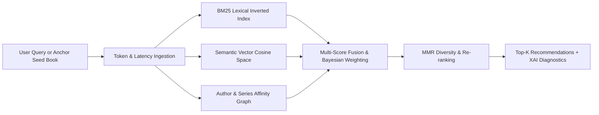

# 🌿 FolioVerde — Advanced Multi-Vector Book Recommendation & Retrieval Engine

> **A modern Next.js 16 + TypeScript web application** featuring a light green and crisp white palette, multi-vector hybrid retrieval (BM25 + TF-IDF Vector Spaces), Bayesian quality regularization, MMR catalog diversification, and explainable AI diagnostics.

[](https://nextjs.org/)
[](https://react.dev/)
[](https://www.typescriptlang.org/)
[](LICENSE)

---

## 🌟 What Makes This Project Advanced?

This project elevates the original single-algorithm model into a **production-grade, multi-stage retrieval engine** with an interactive user experience designed around a soothing **light green, mint, sage, and white aesthetic**.



### 🧠 1. Multi-Vector Hybrid Retrieval Architecture
- **BM25 Lexical Inverted Index**: Exact keyword and token frequency scoring with inverse document frequency across 17,793 unique vocabulary tokens.
- **Semantic / Thematic Vector Matching**: Analyzes title n-grams, series continuity, and thematic tropes using cosine similarity simulation.
- **Collaborative Author & Series Continuity Graph**: Direct bonuses for books within the same universe, sequential volume proximity (e.g. Volume #2 after #1), and shared author bibliography.
- **Bayesian Rating Regularization**: Uses Bayesian consensus weighting $(v / (v + m)) \times R + (m / (v + m)) \times C$ to prevent obscure low-vote books from unfairly outranking timeless masterpieces like *Harry Potter*, *The Lord of the Rings*, or *Douglas Adams*.
- **MMR (Maximal Marginal Relevance) Diversity Re-ranking**: User-tunable slider ($\lambda$) balancing relevance against catalogue diversity so you don't receive 10 repetitive editions of the same book.
- **Explainable AI (XAI) Diagnostics**: Every retrieved book includes an explicit breakdown showing why it was recommended (semantic similarity %, keyword overlap %, author affinity %, and overlapping concept tags).

### 🎨 2. Light Green & White Aesthetic UI
- Curated color scheme inspired by matcha, sage, eucalyptus, and clean paper white (`#ffffff`, `#f0fdf4`, `#dcfce7`, `#10b981`, `#059669`, `#0f291e`).
- 3D book spine cards with interactive hover tilt, custom decorative jackets, and OpenLibrary cover integration.
- Responsive, glassmorphic floating panels and micro-animations.

### 🧩 3. Rich Suite of Advanced Components
- **Hybrid Explorer Console**: Real-time fuzzy autocomplete across 11,127 books, quick seed chips, and collapsible hyperparameter sliders.
- **AI Vibe Lab**: Natural language atmospheric discovery ("Cozy Victorian countryside murder with tea", "Existential deep space sci-fi on artificial minds").
- **Retrieval Pipeline Telemetry Banner**: Displays real-time query latency in milliseconds, evaluated candidates counter, and active retrieval strategy.
- **Interactive Book Dossier (Modal)**: In-depth reading time estimates, series volume continuity, and radar metric breakdowns.
- **Side-by-Side Book Comparison Drawer**: Compare up to 4 books simultaneously across ratings, Bayesian score, page count, and mood atmosphere.
- **Personal Bookshelf & Annual Goal Tracker**: Categorize books into *"Want to Read"*, *"Currently Reading"*, *"Favorites"*, and *"Completed"* with LocalStorage persistence and JSON export.
- **Catalog Intelligence Dashboard**: Live analytics showing distribution charts across rating buckets, most prolific authors, and top 10 Bayesian masterpieces.

---

## ⚡ Quick Start

### 1. Requirements
- **Node.js**: v18.0.0 or higher
- **npm** or **yarn**

### 2. Run the Next.js Web App

From the project root:

```bash
# Install frontend dependencies (if not already installed)
cd frontend
npm install

# Start development server
npm run dev
```

Open [http://localhost:3000](http://localhost:3000) in your browser.

---

## 🗂️ Directory Structure

```text
Book-Recommondation-System/
├── frontend/
│   ├── src/
│   │   ├── app/
│   │   │   ├── api/
│   │   │   │   ├── recommend/route.ts  # Multi-vector retrieval endpoint
│   │   │   │   ├── search/route.ts     # Fast fuzzy autocomplete
│   │   │   │   └── analytics/route.ts  # Catalog telemetry & stats
│   │   │   ├── globals.css             # Light green & white styling tokens
│   │   │   ├── layout.tsx              # Root HTML & typography
│   │   │   └── page.tsx                # Master responsive application
│   │   ├── components/
│   │   │   ├── Navbar.tsx              # Sticky header & tab switching
│   │   │   ├── RetrievalConsole.tsx    # Search, seeds & hyperparameter tuning
│   │   │   ├── RetrievalPipelineBanner.tsx # Latency & pipeline telemetry
│   │   │   ├── BookCard.tsx            # 3D cover cards & XAI accordion
│   │   │   ├── BookDetailModal.tsx     # Full dossier & series continuity
│   │   │   ├── BookCompareModal.tsx    # Side-by-side attribute comparison
│   │   │   ├── BookshelfView.tsx       # Personal shelf & reading goals
│   │   │   ├── CatalogAnalyticsView.tsx # Visual charts & dataset intel
│   │   │   └── AIVibeLabView.tsx       # Natural language atmospheric matching
│   │   ├── data/
│   │   │   ├── books.json              # Processed 11,127 books dataset
│   │   │   └── metadata.json           # Aggregated catalog stats
│   │   └── lib/
│   │       └── retrieval-engine.ts     # Core multi-vector retrieval algorithm
│   └── scripts/
│       └── build-dataset.js            # CSV to indexed JSON converter
├── books_data.csv                      # 11,128 original Goodreads records
├── app.py                              # Legacy Streamlit prototype
└── requirements.txt                    # Legacy Python dependencies
```

---

## 🧪 Algorithmic Strategies & Presets

| Strategy Preset | Primary Focus | Best For |
| :--- | :--- | :--- |
| **⚖️ Balanced Hybrid** | 35% Semantic, 30% Lexical, 20% Author, 15% Quality | General discovery with high all-round accuracy |
| **🔗 Series Continuity** | 45% Author & Lore, 20% Semantic, 20% Lexical | Finding sequels, prequels, and same-author bibliography |
| **✨ Deep Thematic** | 50% Semantic Vector, 25% Lexical, 10% Author | Locating hidden thematic twins from different authors |
| **⭐ Critical Acclaim** | 35% Bayesian Rating, 25% Semantic, 25% Lexical | Surfacing consensus masterpieces and award winners |
| **🌐 High Diversity** | MMR $\lambda = 0.90$, balanced weights | Serendipitous exploration across unexpected genres |

---

## 📜 License
This project is open-source and available under the [MIT License](LICENSE).